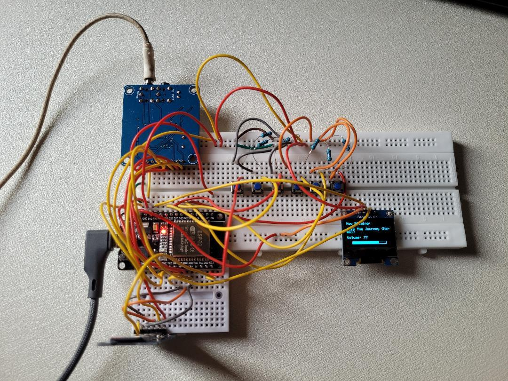

# ESP32 MP3 Player

A custom-built MP3 player using an ESP32, VS1053 audio decoder, SD card storage, OLED display, and physical playback controls.

Current features:
- MP3 playback from SD card
- OLED now-playing and volume display
- Physical playback controls and serial controls
- Shuffle mode
- Volume control
- Track navigation

## Components Used

- ESP32 DevKit V1 (ESP32-WROOM-32)
- VS1053 MP3 decoder module
- MicroSD card module
- 0.96" I2C OLED display
- TP4056 Li-Ion charging module
- 3.7V 950mAh LiPo battery
- MT3608 DC-DC boost converter
- Push buttons and rocker power switch

## How to use
This project was developed using PlatformIO.  
The primary application logic is located in:

`src/main.cpp`

- Change the MAX_FILES variable to however many songs you have
- Make sure the SD card contains only .mp3s
- All mp3s should be stored at root only and the names should be as short as possible (see faq down below)

Flash the project to an ESP32 using PlatformIO or whatever method you prefer with the required dependencies installed.

As for wiring, right now it's given in wiring.txt which is a personal note I was using to keep track of the wiring. It is a bit confusing but it will be replaced with a proper wiring diagram later.

## Questions which you will probably have after looking at my code
Q1)Why are you not using standard spi pins?  
A)The standard SPI pin configuration caused everything to (figuratively) explode. After extensive testing with multiple pin combinations, I settled on the first fully stable configuration.

Q2)Why not literally just use your phone or buy an mp3 player?  
A) Yes, I could have just used my phone, but I wanted to build something cool. (rip ipod)

Q3)Why do song names not update dynamically? Why manually define them?  
A) Long song names cause the SD card mount to fail. No I'm not joking. So I named all the mp3 files as 01.mp3, 02.mp3 etc and just made a hardcoded name to be displayed for each.

## Future improvements
- Organise the repo 
- Replace wiring.txt file with actual diagram
- Make a pcb (in progress!)
